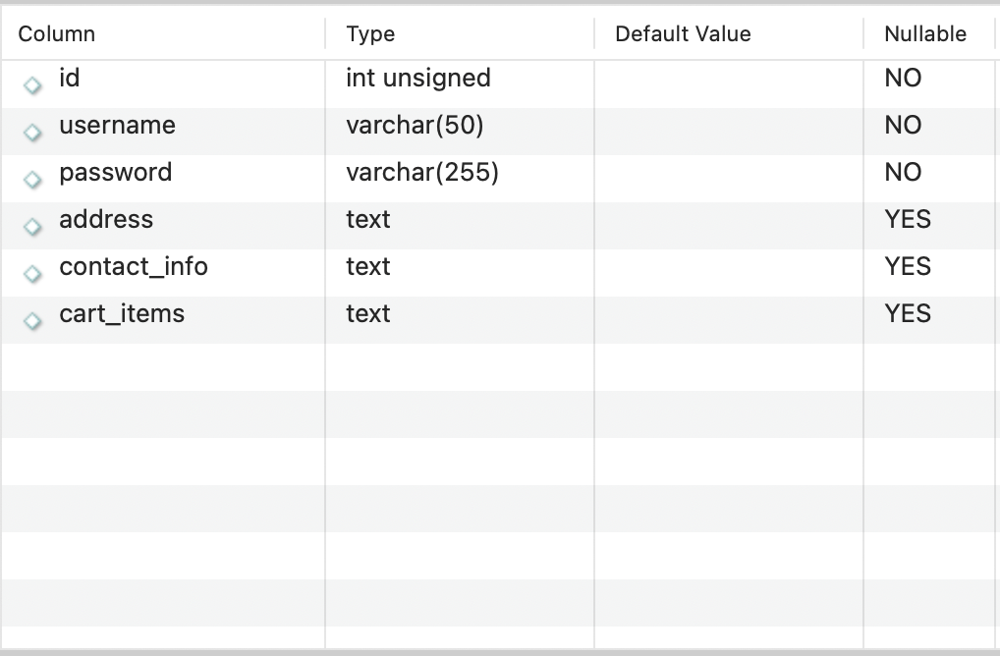
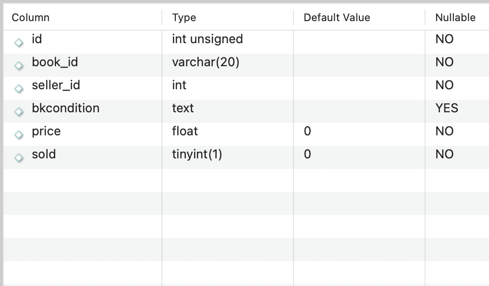
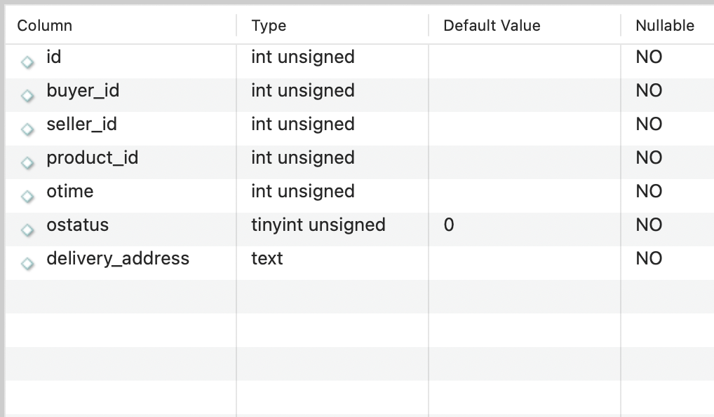

# CSC207 - Second-Hand Book Transaction Platform

## Project Specification for Group #66

### Table of Contents
1. Project Overview
2. Features
3. User Stories
4. Entities and Data Model
5. Proposed API
6. Installation Instructions
7. Usage Guide
8. License
9. Feedback
10. Contributions
11. Team Members

### Project Overview (Domain):
Purpose: The domain of this project is second hand book transaction. This software should allow user to buy or sell second hand books by providing transaction functionalities including account (for both buyers and sellers) registration and management, product (book) posting and order management. Additionally the software could allow user to look for, main.java.view details of, comment on books and add books to shopping carts. An extension to the software functionality could be price drop notification and book recommendation. This platform promotes affordability, accessibility, and sustainability by enabling users to reuse books efficiently. This project was developed to provide a cost-effective solution for accessing books and encourage the reuse of valuable resources. It solves the problem of high costs for new books by creating an efficient second-hand marketplace.

### Features (Software specification):
+ Major Features
  - Account registration and management: allow user to register an account to buy and/or sell books after completing their profiles including but not limited to their name, address and contact information.
  - Product posting: allow any registered user to post a product, edit product details and delete product details.
  - Order management: allow user buy a product which generates an order. The order can be completed or cancelled.
+ More Features
  - Search a product by titles, authors, subject, etc
  - View details of a product including book condition, summary and description.
  - Add a book to shopping cart
+ Future Features (not implemented)
  - Notify buyers when there's a price decrease
  - Recommend a book to buyer (Exp: Mario asks for futuristic scientific fiction that must contains aliens. Gpt will return 10 books related to this topic and write few sentences recommending each book)

### User stories:
- User story #1: Tom have a few course book to sell, so he wants an account that enables him to post and sell books. (**assigned to Jing**)
- User story #2: Lucas wants to buy some entertaining books but have no idea which book fits her need. She wants to search for book based on genre. (**assigned to Bosco**)
- User story #3: Louis wants to buy some text books at lower price because he doesn't afford new ones. He doesn't mind if the book contains notes and drawings. He wants to be able to add the books to shopping cart. (**assigned to Tianao**)
- User story #4: Britney wants to buy some books for her kids, but she doesn't know which one her kids really like. So she want to pick a few and store them in the cart for later use. (**assigned to Eric**)
- Team user story: Jack would like to buy some books from a cheaper source after selling some unused one at his home. He wants an account that enables him to do so. (**assigned to Team**)

### Entities and Data Model:
Entities:
- User: id, username, password, address, contact_information, cart_items (list of productId)
- Book: id, image_url, title, authors, language, translators, subject, description, samples (table of contents and first few pages)
- Product: id, book_id, seller_id, book_condition, price, sold
- Order: id, buyer_id, seller_id, product_id, order_time, order_status, delivery_address
Data Model:

The data model is designed to capture the relationships between users, books, and products. Each entity is interconnected to facilitate the platform's functionalities:
User: Can act as both buyer and seller, with references to products they are selling and orders they have placed.
Book: Serves as a template containing bibliographic information, which multiple products can reference.
Product: Represents an individual book listed for sale, linked to a specific book and user (seller).

**\* Note that a product must corresponds a book instance. A book instance is created by accessing Google Books API**

### Proposed API
The platform integrates with the Google Books API to fetch book details like title, author, and descriptions.
**\* Note that a product must corresponds a book instance. A book instance is created by accessing Google Books API**

### Installing Instruction:
Requirements:
- Programming Language: Java
- Database: SQLite
- API Integration: Google Books API
- Development Environment: IntelliJ IDEA
- 
Steps to Install:
Clone the repository: git clone https://github.com/CSC207-Project.git

Install required dependencies:
Insure the Java Development Kit (JDK) is installed (version 11 or higher).
Install SQLite for database management.

Run the application:
Compile the code in IntelliJ IDEA or another IDE.
Set up Google Books API integration by acquiring an API key.

### Usage Guide
Register an Account:
- Fill out a form with name, contact info, and address to create an account.

Post a Book for Sale:
- Navigate to the “Post Product” section, add details, and submit.

Search for Books:
- Use filters (e.g., genre or author) to browse the catalog.

Add to Cart and Checkout:
- Select books, add to cart, and proceed to contact the seller or save for later.

### License
This project is licensed under the MIT License, allowing users to modify, distribute, and use the code freely.

### Feedback
We welcome feedback from users to improve the platform! Submit your feedback through this Google Form. Please ensure feedback is constructive and follows our guidelines for respectful communication.
https://docs.google.com/forms/d/e/1FAIpQLSe7nTZ12C8e2WsJINz6YT_ZbgUe92TbUcXaSRyD2Ww2ASvdUA/viewform?usp=sf_link

### Contributions:
Contributions are welcome! To contribute:
Contact one of our developers in the members section
Fork the repository on GitHub.
Make changes and submit a pull request with a description of your contribution.
Follow bloew protocals and merge request guidelines to ensure smooth integration

# Guidelines for Creating a Good Merge Request:
Write a Clear Title and Description:
Use a descriptive and concise title that summarizes the purpose of the merge request.
Provide a detailed description in the body, including:
The purpose of the changes.
The problem being solved or feature being added.
Relevant issue numbers 

Ensure Your Code Meets the Standards:
Follow the project's coding conventions and guidelines.
Include comments for any complex logic or changes.
Write unit tests for new functionality or fixes and ensure all existing tests pass.

Keep the Merge Request Focused:
Limit the scope to a single feature, bug fix, or improvement.
Avoid bundling multiple unrelated changes in one request.

Provide Relevant Evidence:
Attach screenshots, logs, or other evidence for changes that impact the user interface or functionality.
Include a brief explanation of how the changes were tested.

Review and Resolve Conflicts:
Regularly pull changes from the main branch to minimize conflicts.
Resolve any merge conflicts locally before submitting the request.

# Protocols for Reviewing Contributions and Merging Them:
Initial Review:
Ensure the merge request adheres to the contribution guidelines (e.g., clean architecture, tests included).
Verify that the changes align with the project's goals and roadmap.

Code Review Process:
At least one team member must review the changes before approval.

Reviewers should check for:
Code quality and adherence to project standards.
Potential impacts on existing functionality.
Proper test coverage and evidence of testing.

Run Automated Checks:
Ensure the merge request passes all automated tests, including unit tests and integration tests.
Check for static code analysis or linting issues if applicable.

Request Changes if Necessary:
Provide specific, constructive feedback for improvements.
Mark the merge request as "Changes Requested" until the issues are resolved.
Approval and Merge:

Once the merge request meets all requirements and passes reviews, a team member with merge privileges can approve it.
Use a non-fast-forward merge or squash commit (based on the team's preference) to ensure a clean commit history.
Post-Merge Protocols:

Notify contributors about the successful merge and next steps.
Ensure any related documentation, issue tracking, or release notes are updated accordingly.

### Database:
Here are how the database is designed to record the data, entities should rely on them but shouldn't be identical to their database conterparts.

|                                                        |                                                              |
|--------------------------------------------------------|--------------------------------------------------------------|
| <strong>user</strong>       | <strong>product</strong>    |
| <strong>order</strong>    |                                                              |

### Meeting Schedules:
Meetings: every Saturday offline or online meetings

### Team Members
| Team Members | Github Username |
|--------------|-----------------|
| Jing Wei     | Wesley-GITT     |
| Bosco Zeng   | BoscoZZZ        |
| Tianao       | aotian69        |
| Eric Zhang   | Juntongdalao    |
