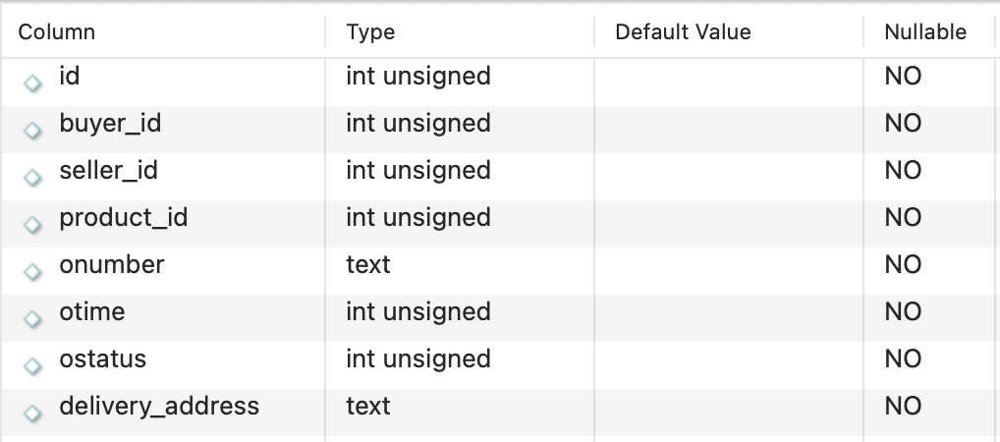
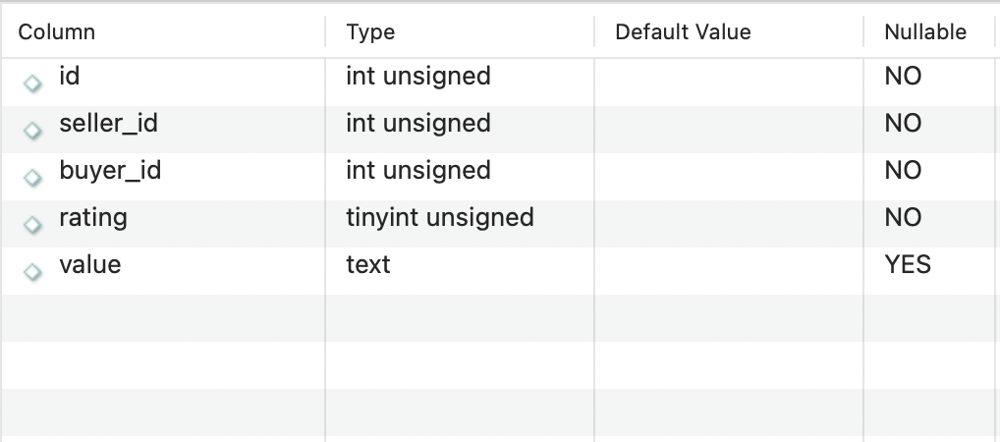
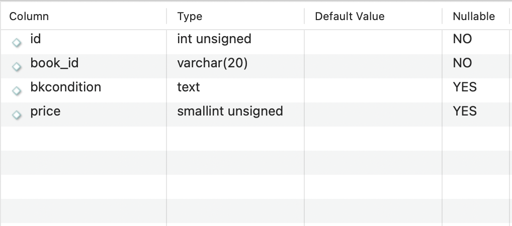
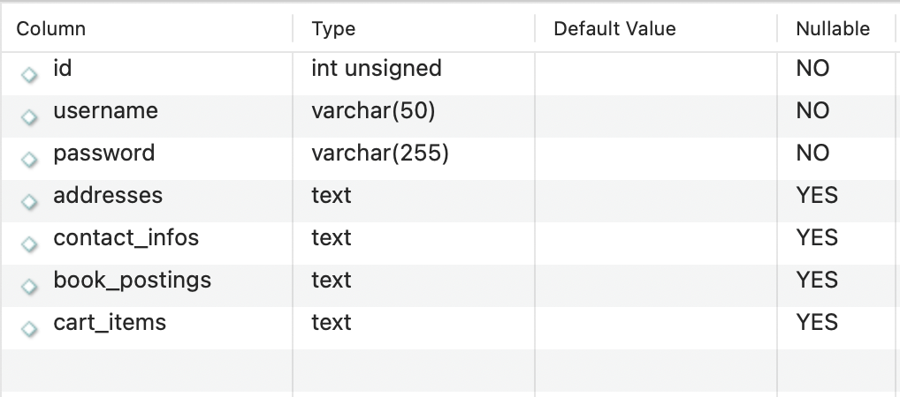

# CSC207-Project

## Project Specification for Group #66

### Domain:
The domain of this project is second hand book transaction. This software should allow user to buy or sell second hand books by providing transaction functionalities including account (for both buyers and sellers) registration and management, product (book) posting and order management. Additionally the software could allow user to look for, view details of, comment on books and add books to shopping carts. An extension to the software functionality could be price drop notification and book recommendation.

### Software specification:
+ Major Features
  - Account registration and management: allow user to register an account to buy and/or sell books after completing their profiles including but not limited to their name, address and contact information.
  - Product posting: allow any registered user to post a product, edit product details and delete product details.
  - Order management: allow user buy a product which generates an order. The order can be completed or cancelled.
+ More Features
  - Search a product by titles, authors, subjects, genres, etc
  - View details of a product including book condition, summary, table of contents, and first few pages.
  - Comment on books they have bought
  - Add a book to shopping cart
+ Bonus Features
  - Notify buyers when there's a price decrease
  - Recommend a book to buyer

### User stories:
- User story #1: ... wants to sell some books he has read but no longer wishes to read in the future.
- User story #2: ... wants to buy some entertaining books but have no idea which book fits her need. She wants to search for book  based on genre and would like to read a book's table of contents and first few pages to decide if she really wants it.
- User story #3: ... wants to buy some text books at lower price because he doesn't afford new ones. He doesn't mind if the book contains notes and drawings. He would also like to receive a price drop notification on books he added to shopping cart
- User story #4: ... wants to buy some books for her kids but she doesn't know which one her kids really like. So she want to pick a few and store them in the cart for later use.
- User story #5: ... would like to sell some textbooks to other students because he bought extras and can't return the book and request for refund.
### Entities:
- User: id, username, password, name, addresses, list_of_contact_information, list_of_book_posting, list_of_orders, cart_items (list of products)
- Book: id, title, authors, language, translators, publishers, description, samples (table of contents and first few pages)
- Comment: id, writer, rating, value
- Product: id, book_id, book_condition, isbn, language, price, seller, comment_id
- Order: id, seller_id, buyer_id, transaction_id, order_number, date, status, delivery_address
- Transaction: id, buyer_id, lists_of_products

\* Note that a product must corresponds a book instance. A book instance is created by accessing Google Books API

### Database:
Here are how the database record the data, entities should rely on then but they don't necessarily have the same attributes.

#### Order

#### Comment

#### Product

#### User

### Proposed API:
- Google Books API: use Google Books API for searching book details.

### More:
Meetings: every Saturday offline or online meetings
